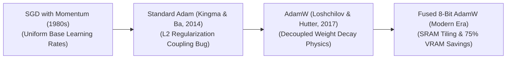

# Awesome-AdamW-Optimizer
## AdamW Optimizer: Evolution, Variants, Types, & Applications

The AdamW optimizer is a hardware-aware stochastic gradient descent optimization algorithm that serves as the default training engine for modern deep neural networks, including foundational Transformers and Large Language Models (LLMs). Introduced by Ilya Loshchilov and Frank Hutter in 2017 ("Decoupled Weight Decay Regularization"), AdamW fixes a structural mathematical flaw in how the standard Adam optimizer handles $L_2$ regularization. By decoupling the weight decay update directly from the moving averages of the gradient calculations, AdamW preserves the optimization benefits of adaptive learning rates while restoring true regularization performance, driving faster convergence and significantly better model generalization.

---

## 1. The Chronological Evolution

The technical progression of gradient-based deep learning optimization reflects a steady trajectory away from rigid, uniform parameter steps toward historical moment tracking, decoupled regularization, and hardware-fused low-precision memory loops.

| Era | Key Concept & Details | Year | First Paper / Source |
| :--- | :--- | :--- | :--- |
| **The Uniform Step Era (Classical SGD with Momentum, ~1980s–2010s)** | **Concept:** The structural baseline. Calculated parameter steps based strictly on current gradients multiplied by a flat learning rate, accelerated by a fraction of the historical directional vector (Momentum) to skip past shallow saddles. **Limitation:** Applied an identical, uniform step scale to all parameters, causing optimization to stall if some features exhibited highly sparse or asymmetric gradient scales. | 1986 | [Learning representations by back-propagating errors](https://doi.org/10.1038/323533a0) |
| **The Adaptive Moment Estimation Era (Standard Adam, 2014)** | **Concept:** Popularized by Kingma and Ba. Introduced unique, per-parameter adaptive learning rates by tracking both the rolling average of past gradients (First Moment / Momentum) and the rolling average of past squared gradients (Second Moment / Variance). **Limitation:** Suffered from a **Weight Decay Coupling Bug**. When developers applied standard $L_2$ regularization, the penalty was fed directly into the adaptive moment equations. Parameters with massive, frequent gradients received a diluted regularization penalty, while parameters with tiny gradients received an excessively magnified penalty, corrupting the model's structural generalization. | 2014 | [Adam: A Method for Stochastic Optimization](https://arxiv.org/abs/1412.6980) |
| **The Decoupled Weight Decay Revolution (AdamW, 2017)** | **Concept:** Solved the coupling bug. Loshchilov and Hutter proved that modifying the optimization graph to apply the weight decay penalty *after* calculating the adaptive moment steps restored the exact mathematical behavior of traditional $L_2$ regularization. **Significance:** The undisputed industry-standard default optimizer for training contemporary transformer architectures and frontier LLMs (e.g., Llama, GPT, Mistral). | 2017 | [Decoupled Weight Decay Regularization](https://arxiv.org/abs/1711.05101) |
| **The Fused Low-Precision & 8-Bit Era (~2022–Present)** | **Concept:** Addresses the modern memory capacity wall. Algorithms like **BitsAndBytes 8-Bit AdamW** quantize the rolling first and second moment states from 32-bit floats down to 8-bit integers dynamically, while compilers like `torch.optim.AdamW(fused=True)` use hardware-aware operator fusion. | 2021 | [8-bit Optimizers via Block-wise Quantization](https://arxiv.org/abs/2110.02861) |

---

## 2. Core Functional & Mathematical Variants

The Adam family tree features specialized mathematical modifications designed to optimize step direction, control variance, or handle structural low-rank compression.

| Variant | Mechanism & Behavior | Year | First Paper / Source |
| :--- | :--- | :--- | :--- |
| **Standard AdamW (Decoupled Weight Decay)** | **Mechanism:** Explicitly separates the regularizer from the gradient updates: $$\theta_{t+1} = \theta_t - \eta_t \cdot \lambda \cdot \theta_t - \frac{\eta_t}{\sqrt{\hat{v}_t} + \epsilon} \cdot \hat{m}_t$$ **Behavior:** Ensures that every network weight experiences a consistent proportional decay toward zero, stabilizing training trajectories. | 2017 | [Decoupled Weight Decay Regularization](https://arxiv.org/abs/1711.05101) |
| **Adafactor** | **Mechanism:** A memory-efficient variant designed by Shazeer et al. It eliminates the massive $O(N)$ second-moment tracking matrix by factoring the moving variance row-wise and column-wise using sub-rank approximations. **Pros:** Drops optimizer VRAM overhead drastically, making it a prominent choice for early massive text-to-text models like T5. | 2018 | [Adafactor: Adaptive Learning Rates with Sublinear Memory Cost](https://arxiv.org/abs/1804.04235) |
| **Lion (EvoLved Sign Momentum Optimizer)** | **Mechanism:** Discovered via automated symbolic algorithm search by Google. It drops second-moment variance tracking entirely, using a uniform step size scaled exclusively by the *sign* of the combined momentum vector. **Pros:** Requires storing only one historical momentum matrix, cutting tracking VRAM overhead by 50% compared to AdamW while improving training speed on specific vision tasks. | 2023 | [Symbolic Discovery of Optimization Algorithms](https://arxiv.org/abs/2302.06675) |

---

## 3. System Scaling & Memory Footprint Types

Depending on the hardware infrastructure limits and model dimensions, AdamW optimizer tracking parameters are allocated across distinct bit-precisions and distributed sharding profiles.

| Type | Memory Profile & Details | Year | First Paper / Source |
| :--- | :--- | :--- | :--- |
| **FP32 Master Weight AdamW (Standard Mixed-Precision)** | **Memory Profile:** Even if a model executes its forward pass in 16-bit precision (FP16 or BF16), AdamW must maintain the master weights and rolling moments in high-precision 32-bit Float (FP32) tensors to prevent catastrophic numerical rounding stagnation. **VRAM Tax:** For every 1 billion parameters, standard AdamW demands exactly **12 Gigabytes of VRAM** exclusively to host its tracking states (4 bytes for master weights, 4 bytes for momentum, 4 bytes for variance). | 2017 | [Mixed Precision Training](https://arxiv.org/abs/1710.03740) |
| **8-Bit Block-Wise AdamW (BitsAndBytes)** | **Memory Profile:** Quantizes the momentum and variance tracking tensors down to 8-bit blocks on disk, de-quantizing them back to FP32 on-the-fly inside fast GPU registers during step calculations. **Pros:** Compresses optimizer VRAM overhead by up to $75\%$ (dropping from 12GB to 3GB per billion parameters), allowing developers to train significantly larger batch sizes on standard server cards. | 2021 | [8-bit Optimizers via Block-wise Quantization](https://arxiv.org/abs/2110.02861) |
| **ZeRO-Sharded AdamW (DeepSpeed / FSDP)** | **Memory Profile:** Used in multi-node distributed clusters. Instead of duplicating the AdamW states across every single card, the **Zero Redundancy Optimizer (ZeRO-Stage 1/2/3)** shards the optimizer tensors evenly across the entire network cluster array. | 2019 | [ZeRO: Memory Optimizations Toward Training Trillion Parameter Models](https://arxiv.org/abs/1910.02054) |

---

## 4. Production Engineering Challenges & Mitigations

Deploying AdamW across massive distributed pipelines requires delicate calibration of structural boundaries and initialization hyperparameters.

| Challenge | Problem & Mitigation | Year | First Paper / Source |
| :--- | :--- | :--- | :--- |
| **The Learning Rate Warmup and Schedule Dependency** | **The Problem:** At the absolute beginning of a training run, the adaptive moment tracking matrices ($m_t$ and $v_t$) are initialized to zero. Launching a model straight with a maximum learning rate causes massive, erratic parameter updates that instantly destroy initialization boundaries. **Mitigation:** Implementing a strict **Linear Learning Rate Warmup schedule**, forcing the step scale to climb smoothly from zero to peak velocity over the first 1% to 5% of training tokens before activating a Cosine Decay scheduler. | 2017 | [Attention Is All You Need](https://arxiv.org/abs/1706.03762) |
| **The Gradient Clipping Threshold Intervention** | **The Problem:** Deep transformer training frequently encounters sudden, extreme loss spikes caused by chaotic data blocks. If unmitigated, these spikes contaminate the second-moment variance matrix ($v_t$), causing AdamW to scale down steps severely across subsequent epochs, stalling convergence. **Mitigation:** Hardcoding a strict **Global Gradient Norm Clipping boundary** (typically scaled to $\|g\| \le 1.0$), squashing explosive gradient spikes before they enter the optimizer's tracking loops. | 2012 | [On the difficulty of training Recurrent Neural Networks](https://arxiv.org/abs/1211.5063) |

---

## 5. Frontier Real-World AI Applications

| Application | Details & Usage | Year | First Paper / Source |
| :--- | :--- | :--- | :--- |
| **Frontier Foundation LLM Pre-Training Loops** | **Application:** Serves as the primary mathematical optimizer used to train elite base architectures (e.g., Llama 3, Mistral, Gemma, DeepSeek-V3). Decoupled weight decay allows models to train stably over tens of trillions of multilingual tokens without experiencing performance saturation. | 2020 | [Language Models are Few-Shot Learners](https://arxiv.org/abs/2005.14165) |
| **High-Resolution Diffusion and Flow-Matching Synthesis** | **Application:** Optimizes generative image and video platforms (like FLUX.1 or Stable Diffusion 3.5). AdamW's precise per-parameter tracking calibration allows deep transformer layers to learn low-frequency spatial compositions alongside microscopic high-frequency image textures simultaneously. | 2020 | [Denoising Diffusion Probabilistic Models](https://arxiv.org/abs/2006.11239) |
| **Distributed Parameter-Efficient Alignment Sprints (LoRA / QLoRA)** | **Application:** Deployed within enterprise post-training pipelines. Fused or 8-bit AdamW profiles optimize target low-rank adapters over domain-specific corporate data (such as legal or medical datasets), updating behavioral personas rapidly within restricted compute infrastructures. | 2021 | [LoRA: Low-Rank Adaptation of Large Language Models](https://arxiv.org/abs/2106.09685) |
