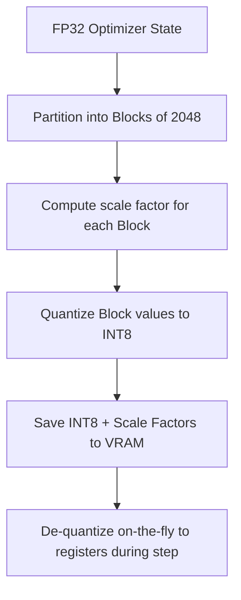

# 8-Bit Block-Wise AdamW (BitsAndBytes)

8-Bit Block-Wise quantization dynamically compresses optimizer tensors down to 8-bit representations, minimizing memory storage overhead while performing mathematical operations in FP32.

## Key Concept
Instead of a single global scale factor, the tensor is partitioned into small blocks (e.g. size 2048). Each block has its own dynamic scale factor, which maintains the precision needed for adaptive moments.

## Compression Flow

[← Back to README](../README.md)
