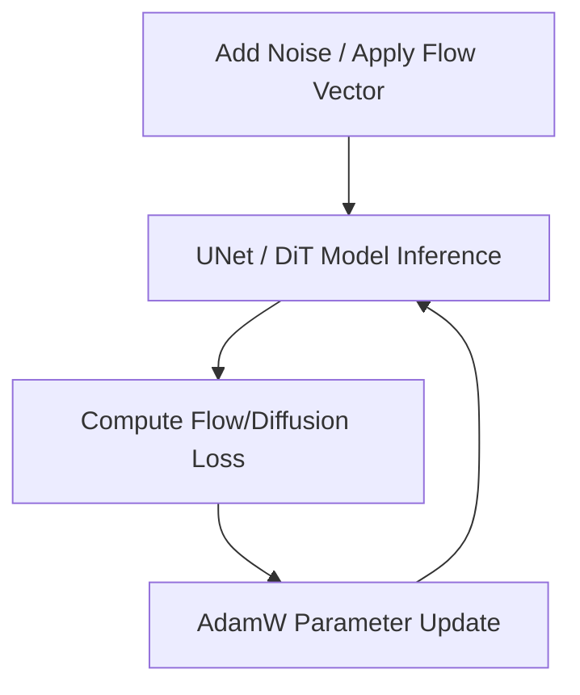

# High-Resolution Diffusion and Flow-Matching Synthesis

Generative vision models rely on AdamW to learn multiscale textures and spatial composition simultaneously.

## Application Details
- **Multiresolution Gradients:** The variance tracking in AdamW scales parameter updates dynamically, matching features corresponding to both rough structural elements (e.g. general shapes) and fine details (e.g. photorealistic textures).
- **Flow Matching:** Optimizes path trajectories between noise distribution and data distribution.

## Optimization Loop

[← Back to README](../README.md)
