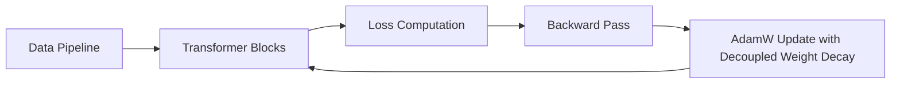

# Frontier Foundation LLM Pre-Training Loops

AdamW is the default training optimizer for state-of-the-art Large Language Models.

## Roles & Integration
- **Stability:** Handles learning rate warmup and gradient scaling to train across trillions of tokens.
- **Generalization:** Decoupled weight decay acts as true regularization, forcing model weights to decay uniformly without interference from gradient statistics.

## Training Architecture

[← Back to README](../README.md)
