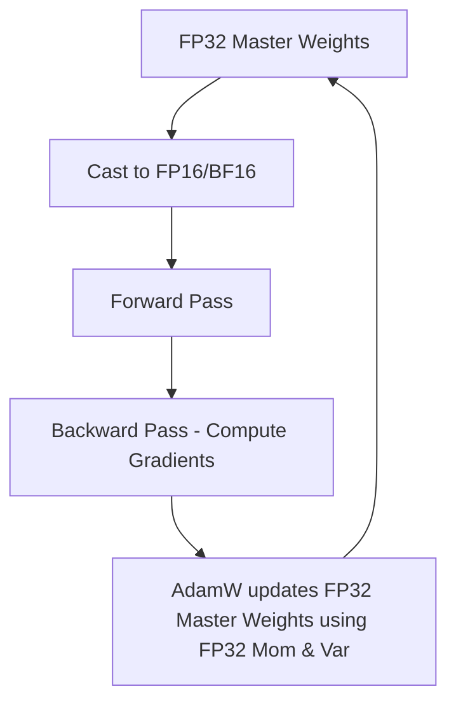

# FP32 Master Weight AdamW (Standard Mixed-Precision)

Standard mixed-precision training executes model layers in lower precision (FP16 or BF16) to speed up execution, but preserves optimizer updates and master weights in FP32 to ensure numerical stability.

## Why FP32 Master Weights?
Gradient updates are often very small. In FP16/BF16, these values can round down to zero (underflow), causing training to stall. Keeping the master weights in FP32 prevents rounding errors and maintains update fidelity.

## Mixed Precision Loop

[← Back to README](../README.md)
