# The Fused Low-Precision & 8-Bit Era (BitsAndBytes & Fused AdamW)

Modern large language models contain billions of parameters. Traditional FP32 optimizer states consume up to three times the memory required for the model weights themselves. Fused low-precision optimizers solve this memory capacity bottleneck.

## Core Features
1. **Fused Kernels:** Combines multiple operations (e.g. element-wise additions, square roots, scale multiplications) into a single GPU kernel to minimize high-latency memory transfers between GPU High Bandwidth Memory (HBM) and SRAM.
2. **8-Bit Quantization:** Stores the first and second moments in 8-bit dynamic formats instead of full 32-bit floats.

## Comparison of VRAM Consumption

```mermaid
gantt
    title Optimizer Memory Footprint per Billion Parameters
    dateFormat  X
    axisFormat %s
    FP32 Master Weight & Moments : active, 0, 12
    8-Bit Block-wise AdamW : 0, 3
```

[← Back to README](../README.md)
