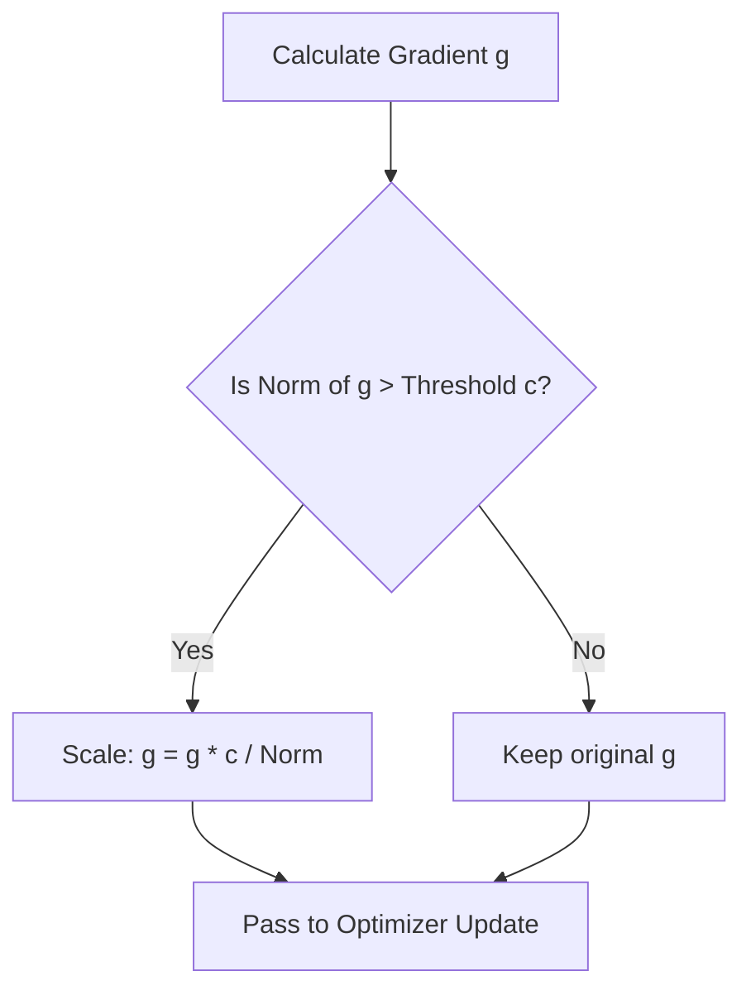

# Gradient Clipping

Gradient clipping is a technique to prevent exploding gradients by clipping gradients that exceed a predefined threshold value during backpropagation.

## Types
1. **Value Clipping:** Clips individual gradient coordinates if they exceed a range $[-c, c]$.
2. **Norm Clipping:** Scales the entire gradient vector $g$ if its $L_2$ norm exceeds a threshold $c$:

$$g \leftarrow g \cdot \min\left(1, \frac{c}{\|g\|_2}\right)$$

## Process

[← Back to README](../README.md)
