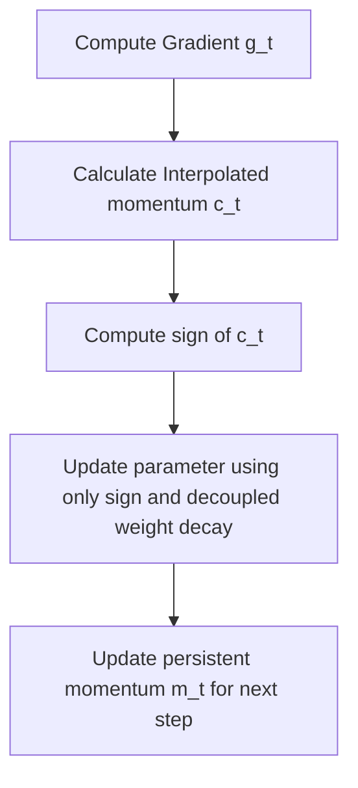

# Lion (EvoLved Sign Momentum Optimizer)

Lion was discovered by Google researchers via evolutionary program synthesis. It uses only the sign of the momentum, discarding the second-moment variance tracking entirely.

## Mechanism
Lion updates parameters using:

$$c_t = \beta_1 m_{t-1} + (1 - \beta_1) g_t$$
$$\theta_t = \theta_{t-1} - \eta_t (\text{sign}(c_t) + \lambda \theta_{t-1})$$
$$m_t = \beta_2 m_{t-1} + (1 - \beta_2) g_t$$

## Advantages
- Only requires storing the momentum ($m_t$), reducing optimizer state VRAM from 8 bytes to 4 bytes per parameter compared to AdamW.
- Simplified update formula runs faster and can improve training stability.

## Flow Diagram

[← Back to README](../README.md)
