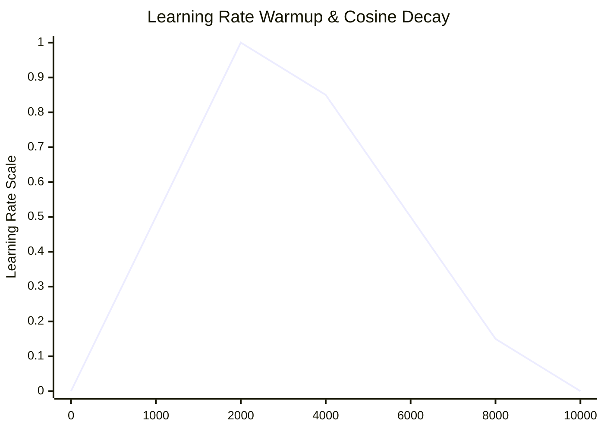

# Learning Rate Warmup and Schedule Dependency

At the beginning of training, adaptive moments are uninitialized (zero). Standard schedules with high initial learning rates can cause unstable and divergent updates.

## Mitigation
**Linear Warmup:** Linearly scales the learning rate from 0 to its maximum value over a set number of startup steps (e.g. 2000 steps). After warmup, a standard scheduler (like Cosine Annealing) takes over.

## Warmup Schedule Plot

[← Back to README](../README.md)
