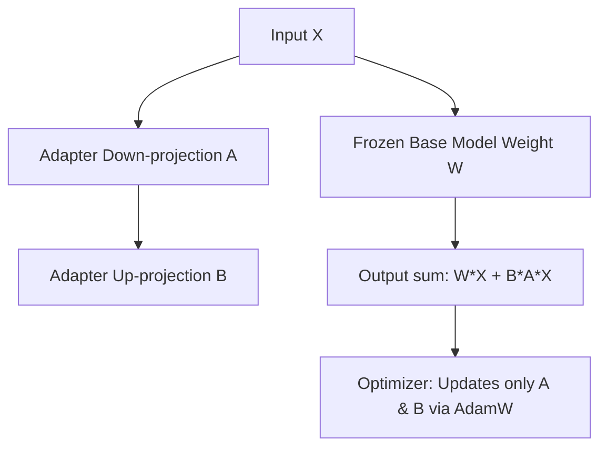

# Distributed Parameter-Efficient Alignment Sprints (LoRA / QLoRA)

For post-training, parameter-efficient alignment (like Low-Rank Adaptation - LoRA) reduces the parameter update footprint. When combined with quantized 8-bit AdamW, training memory overhead is reduced dramatically.

## Mechanics
- **Base Model:** Kept frozen (optionally 4-bit quantized in QLoRA).
- **Adapters:** Small trainable matrices (A and B).
- **Optimizer:** AdamW updates only adapter parameters, dramatically shrinking VRAM.

## Parameter Flow

[← Back to README](../README.md)
