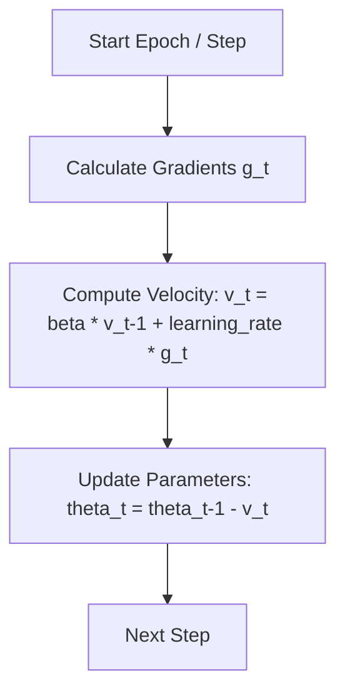

# SGD with Momentum (Classical SGD with Momentum)

Stochastic Gradient Descent (SGD) with Momentum is a fundamental optimization technique that accelerates gradient descent by accumulating a velocity vector in the direction of persistent reduction in the objective function.

## How it Works
Rather than updating parameters strictly based on the current gradient, Momentum remembers the previous update step and adds a fraction of it to the current update step.

$$v_t = \beta v_{t-1} + \eta g_t$$
$$\theta_t = \theta_{t-1} - v_t$$

Where:
- $\theta$: Model parameters
- $v$: Velocity vector
- $\beta$: Momentum coefficient (typically 0.9)
- $\eta$: Learning rate
- $g$: Gradient

## Advantages & Disadvantages
- **Advantages:** Helps navigate ravines, dampens oscillations, and escapes shallow local minima.
- **Disadvantages:** Uses a uniform base learning rate for all parameters, which can be suboptimal for sparse features or highly asymmetric gradient spaces.

## Architecture/Process Flow

[← Back to README](../README.md)
