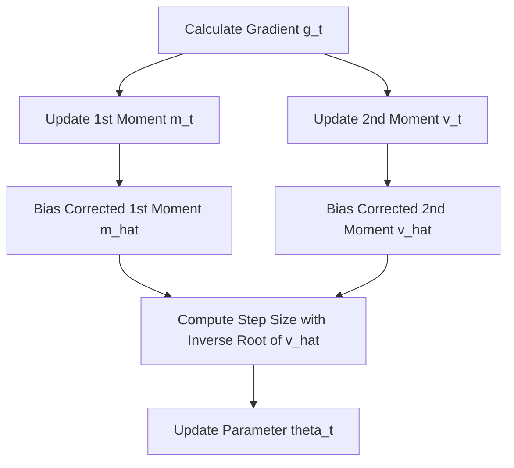

# Standard Adam (Adaptive Moment Estimation)

Standard Adam (2014) is an adaptive learning rate optimization algorithm that computes individual learning rates for different parameters from estimates of first and second moments of the gradients.

## How it Works
Adam maintains moving averages of the gradients $m_t$ and the squared gradients $v_t$:

$$m_t = \beta_1 m_{t-1} + (1 - \beta_1) g_t$$
$$v_t = \beta_2 v_{t-1} + (1 - \beta_2) g_t^2$$

Since $m_t$ and $v_t$ are biased towards zero (especially during initial steps), Adam applies bias correction:

$$\hat{m}_t = \frac{m_t}{1 - \beta_1^t}$$
$$\hat{v}_t = \frac{v_t}{1 - \beta_2^t}$$

The update step is:

$$\theta_t = \theta_{t-1} - \frac{\eta}{\sqrt{\hat{v}_t} + \epsilon} \hat{m}_t$$

## The Weight Decay Coupling Issue
In standard Adam, when developers added $L_2$ regularization, the penalty gradient $2\lambda\theta$ was added directly to $g_t$. This means the regularization penalty itself gets scaled by the inverse square root of the historical gradient variance $\hat{v}_t$. As a result:
- Weights with frequent large gradients receive too little decay.
- Weights with small gradients receive disproportionately large decay.

## Process Flow

[← Back to README](../README.md)
