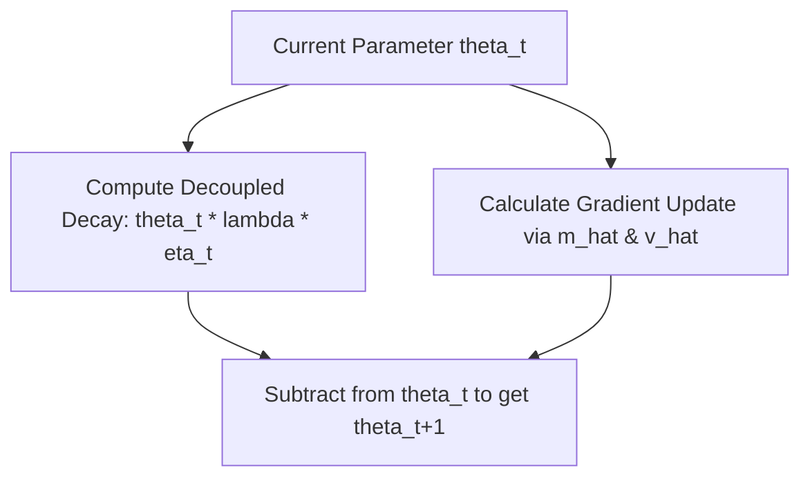

# Standard AdamW (Decoupled Weight Decay)

Standard AdamW is the primary optimization routine for modern neural networks, decoupling learning rate scale calculations from regularization updates.

## Core Formula
$$\theta_{t+1} = \theta_t - \eta_t \cdot \lambda \cdot \theta_t - \frac{\eta_t}{\sqrt{\hat{v}_t} + \epsilon} \cdot \hat{m}_t$$

By subtracting the decay term $\eta_t \cdot \lambda \cdot \theta_t$ directly from the weights, the algorithm prevents weights with high gradient variance from avoiding decay.

## Process Flow

[← Back to README](../README.md)
